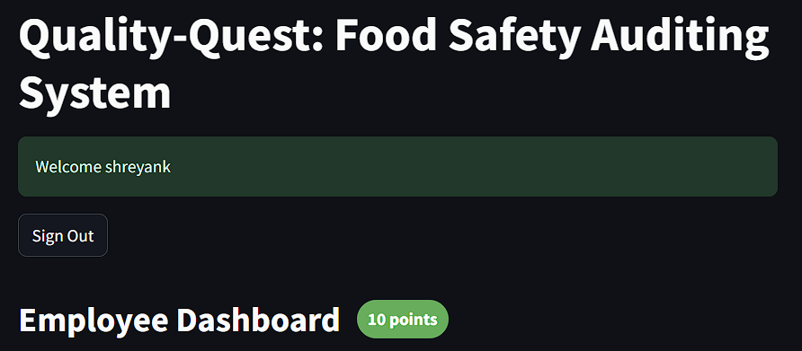

# Team TechMSLF
The prototype is currently hosted on Render.com URL:- [Quality-Quest](https://quality-quest-u9fu.onrender.com)

As it is hosted on a free tier Render account the website might take longer to respond.

## Quality Quest (Product Overview)
The Quality Quest system is an innovative, incentive-driven auditing platform designed to improve food safety standards in production and processing facilities. Hosted on render.com, Quality Quest leverages the power of artificial intelligence (AI) and incentive-based engagement to create an interactive web-based solution. The goal of this system is to transform the routine and often monotonous process of self-auditing into an engaging experience, by integrating competition, rewards, and instant AI feedback.

Through this web application, employees can perform self-audits by uploading images of their workspaces, equipment, and food products. The AI model analyzes these images in real time, detecting potential safety issues such as unclean surfaces, equipment damage, incorrect labeling, or other hazards. Instant feedback is provided, helping employees correct issues immediately. Quality Quest also incorporates a points system to motivate employees, encouraging them to actively participate in ensuring food safety and compliance.

## Motivation
Ensuring food safety in production environments can be a challenging and often repetitive process. Traditional audits, which can feel like burdensome chores, may result in lower employee engagement over time, leading to missed safety risks. Quality Quest was created to address this problem by using an incentive-driven approach to increase engagement and accountability among employees. Hosted on render.com, the web-based platform integrates human efforts with AI to deliver real-time compliance checks, making food safety audits more interactive and rewarding.

The integration of an incentive-based system—such as awarding points for completing audits provides rewards that encourage employees to maintain high safety standards. Management also benefits from the platform, as they receive real-time data-driven insights on trends across the facility, enabling them to address problem areas before they become critical.

## Key Components

### 1. `app.py`
The main application script that initializes and runs the server. It integrates all the other components and handles requests from users and managers for image processing, auditing, and database management.

### 2. `employee.py`
This module is responsible for handling employee-related functionalities. Employees can upload images, raise issues, and interact with the auditing system through this module.

### 3. `gemini_solution.py`
Contains the solution for detecting issues from images. The AI model analyzes the uploaded images and classifies them based on predefined labels like "serious" or "not serious".

### 4. `login_system.py`
Handles the authentication system. This module allows users to log in and manage their accounts in a secure manner.

### 5. `manager.py`
The manager's dashboard, where all raised issues are displayed. Managers can review the issues, look at the uploaded images, and check the suggested solutions provided by the AI.

### 6. `setup_db.py`
A script to initialize and configure the database (`auditing.db`). It contains the structure and schema definitions necessary for setting up the auditing system and storing employee/manager data.

### 7. `auditing.db`
The SQLite database used by the application to store employee, issue, and audit data.

### 8. `requirements.txt`
A list of dependencies required to run the project. You can install all necessary Python libraries by running:

## Usage

- **Employees:** Employees can upload images through the employee dashboard, which will be processed by the AI model to detect issues.
- **Managers:** Managers can log in to the manager's dashboard and review issues raised by employees. They can view the AI-suggested solutions and take appropriate action.

## AI Image Analysis

The image analysis functionality is powered by a machine learning model integrated into `gemini_solution.py`. It utilizes pre-trained models to analyze uploaded images and detect whether they represent a serious issue or not.

## Example Use Scenario
In a food processing facility, employees are responsible for ensuring cleanliness and safety standards are met at their workstations. James, one of the employees, logs into the Quality Quest platform, hosted on render.com, from his desktop workstation. James takes photos of his workstation using his computer’s camera and uploads them directly to the platform. The AI system detects that one of the food preparation areas (From the uploaded image) has residue on the surface and flags it int the manager dashboard. James earns points raising an issue, which are tracked on the platform.

Later, James notices an improperly labeled food package and uploads an image about the issue through the system. This proactive action earns him more points, encouraging friendly competition among his coworkers. The points James accumulates can be redeemed for rewards, such as gift cards or additional break time, motivating him to continue maintaining high safety standards.

**(Note - Currently not everything mentioned in the example is implemented)**

# Prototype Images

## Landing Page

## Employee Dashboard

## Employee Login

## Employee Signup

## Manager Dashboard (Accepted Issues)

## Manager Dashboard (Current Issues)

## Manager Login

## Manager Signup

## Raise Issue (Employee)

## Issue Raised Successfully (Employee)

## Manager View of Raised Issue

## AI Analysis on Raised Issue

Note- As this is a prototype we havent got the AI features to completely work (due to time constraint)

## Manager Accepts Issue

After Manager Accepts the issue raised as valid, the employee gets 10 points:
## Employee Dashboard (10 Points)

